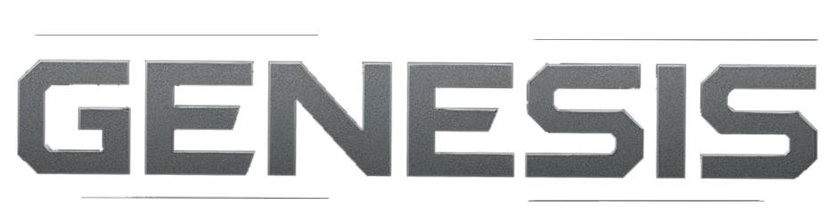

# Model2Bo3 - Universal Game Model Converter for Black Ops 3



Convert game models from various formats to Call of Duty Black Ops 3 format (XMODEL_EXPORT) with automatic texture handling, material preservation, and folder structure management.

**Currently Supports:**
- **Fallout 4** - NIF format (full support)
- **Skyrim** - NIF format (planned)
- **OBJ** - (planned)
- **FBX** - (planned)
- **DAE (Collada)** - (planned)
- **Additional formats** - Coming soon

## 🚀 Quick Start

1. **Download** and set up required dependencies (see Requirements below)
2. **Launch** `Model2Bo3.exe`
3. **Select** your model file (NIF, etc.)
4. **Choose** output directory
5. **Click Convert** - Done!

## 📦 Requirements

### Required External Dependencies

Model2Bo3 requires these external components to function properly. These are **NOT** included in the repository and must be downloaded separately:

#### 1. PyNifly Library (Required)

**What it is:** Python library for parsing NIF files (Fallout 4, Skyrim) with native DLL support.

**How to get it:**
1. Visit: **https://github.com/niftools/blender_niftools_addon**
2. Download the latest release or clone the repository
3. Copy the entire `io_scene_nifly` folder contents to: `converter/src/pynifly/`

**Required files:**
```
converter/src/pynifly/
├── pynifly.py
├── niflytools.py
├── nifdefs.py
├── pynmathutils.py
├── xmltools.py
├── bgsmaterial.py
└── NiflyDLL/
    └── x64/
        └── NiflyDLL.dll  ← Critical for NIF parsing
```

**Verify installation:**
```powershell
Test-Path "converter\src\pynifly\pynifly.py"        # Should return True
Test-Path "converter\src\pynifly\NiflyDLL\x64\NiflyDLL.dll"  # Should return True
```

#### 2. HKX Tools (Required for Fallout 4 Skeletons)

**What they are:** Tools for converting Havok HKX skeleton files to XML format.

**How to get them:**
- **hkxcmd.exe** - Search "hkxcmd Skyrim" online, available from various modding sites
- **hkxpack-cli.jar** & **hkxpack-core.jar** - From HKXPack project

**Where to place them:**
```
converter/tools/
├── hkxcmd.exe
├── hkxpack-cli.jar
└── hkxpack-core.jar
```

**Note:** These tools are needed to extract skeleton/bone data from Fallout 4's HKX files.

#### 3. Bethesda Archive Extractor (B.A.E) - For Textures

**What it is:** Tool to extract textures from Fallout 4's BA2 archive files.

**Why you need it:** Fallout 4 stores textures in compressed BA2 archives, not as loose files. You must extract them first.

**How to use:**
1. Download B.A.E from Nexus Mods or other modding sites
2. Open B.A.E and navigate to your Fallout 4's Data folder
3. Extract texture archives (e.g., `Textures - Main.ba2`)
4. Point Model2Bo3's texture path setting to the extracted folder

**Example:**
```
Extracted textures: C:/FO4_Extracted/Textures/
Set in Model2Bo3 settings: texture_path = "C:/FO4_Extracted/Textures/"
```

### Optional Tools

#### export2bin.exe (Black Ops 3 Modtools)

**What it is:** Official BO3 tool to compile XMODEL_EXPORT to XMODEL_BIN format.

**Where to get it:** Included with Call of Duty Black Ops 3 Modtools
- Location: `steamapps/common/Call of Duty Black Ops III/bin/export2bin.exe`

**How to use in Model2Bo3:**
1. Open Settings in Model2Bo3
2. Set "Export2Bin Path" to your export2bin.exe location
3. Enable "Auto-Compile to BIN" for automatic compilation

### Python Dependencies (For Source Users)

If running from source code instead of the .exe:

```bash
cd converter
pip install -r requirements.txt
```

**Packages:**
- PyQt6 - GUI framework
- Pillow - Image processing (texture conversion)
- PyFFI - Fallback NIF parsing
- numpy - Numerical operations

## ✨ Features

### Core Functionality
- **Multi-Format Support** - NIF files (Fallout 4, Skyrim), with more formats planned
- **Multi-Material Meshes** - Preserves all materials per mesh (no splitting required)
- **Automatic Texture Discovery** - Finds and copies diffuse, normal, and specular maps
- **Folder Structure Preservation** - Maintains relative paths from source game directory
- **Real-time Preview** - View mesh stats before conversion

### Smart Processing
- **Normal Map Auto-Inversion** - Fixes green channel for BO3 compatibility
- **Layered Material Handling** - Processes complex layered materials correctly
- **Texture Path Resolution** - Resolves game-specific texture paths automatically
- **Multiple Format Support** - Handles .DDS, .PNG textures

### User Experience
- **Drag & Drop** - Drop NIF files directly into the window
- **Batch Processing** - Convert multiple files at once
- **Progress Tracking** - Real-time conversion status
- **Error Reporting** - Clear messages for troubleshooting

## 📋 System Requirements

- **OS:** Windows 10/11 (64-bit)
- **RAM:** 4GB minimum, 8GB recommended
- **Storage:** ~100MB for application + space for converted files

## 🎮 Usage Guide

### Basic Conversion

1. **Launch Model2Bo3.exe**
2. **Input Methods:**
   - Click "Browse" to select a model file
   - Drag and drop model files into the window
   - Use "Convert All in Folder" for batch processing
3. **Output Settings:**
   - Choose output directory (default: `output/`)
   - Enable "Auto-copy textures" to copy all textures
   - Enable "Preserve folder structure" to maintain paths
4. **Convert:**
   - Click "Convert" button
   - Wait for completion message
   - Find XMODEL_EXPORT files in output directory

### Folder Structure Preservation

When enabled, maintains relative paths from source game directory:

```
Source Game/
  Meshes/
    Weapons/
      LaserRifle.nif
    Armor/
      VaultSuit.nif

Output Directory/
  Weapons/
    LaserRifle.XMODEL_EXPORT
    LaserRifle_mtl.json
  Armor/
    VaultSuit.XMODEL_EXPORT
    VaultSuit_mtl.json
```

**Benefits:**
- Organized output matching source structure
- Easy to locate converted files
- Batch conversion friendly
- Maintains project organization

### Texture Handling

**Auto-Copy Textures:**
- Copies all referenced textures to output
- Converts normal maps (inverts green channel)
- Handles multiple texture types (diffuse, normal, specular)
- Preserves folder structure if enabled

**Texture Search Paths:**
The converter searches for textures in these locations:
1. Same directory as model file
2. Game-specific texture directories (e.g., Fallout 4/Data/Textures/, Skyrim/Data/Textures/)
3. Relative paths from model location

**Supported Formats:**
- `.dds` (Direct Draw Surface - primary format)
- `.png` (Portable Network Graphics)

### Material Export

Each converted model includes a `_mtl.json` file containing:
- Material names and properties
- Texture file references
- Material slot assignments
- Rendering parameters

**Example:** `LaserRifle_mtl.json`
```json
{
  "materials": [
    {
      "name": "LaserRifleMat",
      "textures": {
        "diffuse": "LaserRifle_d.dds",
        "normal": "LaserRifle_n.dds",
        "specular": "LaserRifle_s.dds"
      }
    }
  ]
}
```

## ⚙️ Settings & Configuration

### Settings File Location

Settings are stored in: `config/settings.json` (created automatically)

### Available Settings

**Input/Output:**
- `last_input_file` - Last selected input file
- `last_output_dir` - Last used output directory
- `preserve_folder_structure` - Maintain relative paths (default: true)

**Texture Processing:**
- `auto_copy_textures` - Copy textures with models (default: true)
- `invert_normal_maps` - Fix normal map green channel (default: true)
- `texture_search_paths` - Additional texture directories

**Processing Options:**
- `export_materials_json` - Create _mtl.json files (default: true)
- `batch_mode` - Process multiple files (default: false)

**UI Preferences:**
- `window_width` - Window width in pixels (default: 1000)
- `window_height` - Window height in pixels (default: 700)
- `theme` - UI theme (default: "dark")

### Editing Settings

1. Close Model2Bo3.exe
2. Open `config/settings.json` in text editor
3. Modify values
4. Save and restart application

**Example settings.json:**
```json
{
  "last_input_file": "C:/Games/Fallout4/Data/Meshes/Weapons/LaserRifle.nif",
  "last_output_dir": "C:/ModProjects/BO3_Weapons/output",
  "preserve_folder_structure": true,
  "auto_copy_textures": true,
  "invert_normal_maps": true,
  "export_materials_json": true
}
```

## 🔧 Troubleshooting

### Dependency Issues

**"NiflyDLL.dll not found" or "Cannot import pynifly"**
- PyNifly is not installed correctly
- Follow PyNifly installation steps in Requirements section
- Verify `NiflyDLL.dll` exists at: `converter/src/pynifly/NiflyDLL/x64/NiflyDLL.dll`
- Check that all PyNifly Python files are present

**"Failed to parse HKX skeleton"**
- HKX tools are missing from `converter/tools/` folder
- Download `hkxcmd.exe`, `hkxpack-cli.jar`, and `hkxpack-core.jar`
- Place them in the `converter/tools/` directory
- Ensure Java is installed for HKXPack JARs

**"Textures not found" (Fallout 4)**
- Fallout 4 textures are in BA2 archives, not loose files
- Extract textures using Bethesda Archive Extractor (B.A.E)
- Set Model2Bo3's texture path to the extracted texture folder
- Do NOT point to `Fallout4/Data/Textures/` (contains only archives)

### Common Issues

**"Failed to load model file"**
- Ensure file is a supported format (NIF, etc.)
- Check file isn't corrupted or locked
- Try opening in appropriate viewer to verify (e.g., NifSkope for NIF files)

**"Textures not found"**
- Verify textures exist in game's texture directory
- Enable "Auto-copy textures" setting
- Check texture paths in model file

**"No geometry found"**
- Model may contain only collision/skeleton data
- Try a different LOD level (e.g., _LOD0.nif)
- Check model has visible meshes in appropriate viewer

**"Conversion failed"**
- Check output directory is writable
- Ensure sufficient disk space
- Look for error details in console (if debug mode)

### Getting Help

If you encounter issues:
1. Check this documentation first
2. Verify your model file works in its source game
3. Try a simple test model (e.g., vanilla game asset)
4. Note exact error message

## 📦 Output Files

### Generated Files

For each converted model, you'll get:

**ModelName.XMODEL_EXPORT** - Main model file
- Contains geometry, vertices, UVs
- Ready for BO3 import
- All materials included

**ModelName_mtl.json** - Material reference
- Material names and assignments
- Texture file paths
- Optional metadata

**Texture Files** (if auto-copy enabled)
- All referenced textures
- Normal maps (with inverted green channel)
- Organized by folder structure

### Using in Black Ops 3

1. **Import XMODEL_EXPORT:**
   - Use BO3 modtools to import
   - Convert to XMODEL_BIN with export2bin.exe

2. **Set Up Textures:**
   - Copy textures to BO3 texture directory
   - Reference in material files
   - Configure material settings

3. **Compile Model:**
   - Build using BO3 asset manager
   - Test in-game

## 📝 Best Practices

### Before Converting

- **Verify Source Files:** Test model works in source game
- **Organize Files:** Keep meshes and textures organized
- **Backup Data:** Keep original files safe

### During Conversion

- **Use Folder Structure:** Enable for organized output
- **Copy Textures:** Enable auto-copy for complete exports
- **Batch Processing:** Convert similar models together

### After Conversion

- **Check Output:** Verify all files generated correctly
- **Review Materials:** Check _mtl.json for texture references
- **Test in BO3:** Import and verify in modtools

## 🎯 Tips & Tricks

### Optimal Workflow

1. **Set Up Directories:**
   ```
   Project/
     Source/          (Game model files)
     Converted/       (Model2Bo3 output)
     BO3_Assets/      (Final BO3 files)
   ```

2. **Configure Settings:**
   - Enable folder structure preservation
   - Enable texture auto-copy
   - Set output to `Converted/`

3. **Batch Convert:**
   - Select folder with multiple model files
   - Use "Convert All in Folder"
   - Review results in organized output

### Quality Tips

- **Use LOD0 Files:** Best quality meshes (_LOD0.nif)
- **Check Materials:** Verify material assignments in preview
- **Texture Resolution:** Higher resolution = better quality
- **Normal Maps:** Let auto-inversion handle conversions

## 📄 License & Credits

**Model2Bo3** - Universal Game Model to Black Ops 3 Converter

**Technologies:**
- PyNifly - NIF file parsing (Fallout 4, Skyrim support)
- PyFFI - Fallback NIF parsing
- PyQt6 - User interface
- Pillow - Image processing

**Supported Games:**
- Fallout 4 © Bethesda Softworks
- Skyrim © Bethesda Softworks (planned)
- Call of Duty: Black Ops 3 © Activision

## 🔄 Version History

### Current Version - Universal Model Converter
- Multi-format support framework (NIF currently supported)
- Multi-material mesh support
- Folder structure preservation
- Automatic texture copying and processing
- Normal map auto-inversion
- Layered material handling
- Real-time preview
- Drag & drop support
- Batch conversion

### Roadmap
- Additional game format support (Skyrim, FO3/NV, etc.)
- More texture type handling
- Advanced material options
- Animation support

---

**Need More Help?** Check the other documentation files:
- `SETTINGS_GUIDE.md` - Detailed settings reference
- `TEXTURE_GUIDE.md` - Texture handling guide
- `TROUBLESHOOTING.md` - Common problems and solutions
- `WORKFLOW_GUIDE.md` - Complete workflow examples
